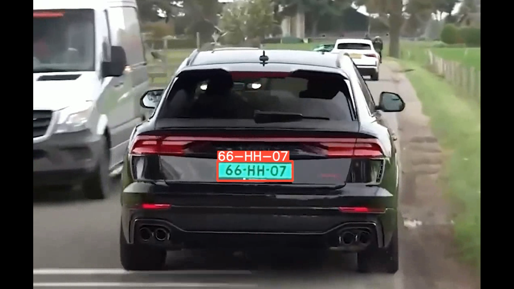
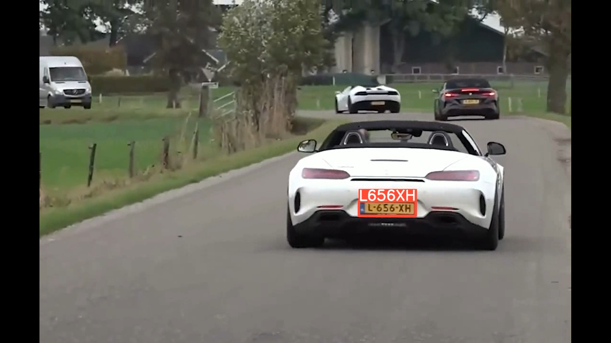

<h1 align="center">Automatic Number Plate Detection and Recognition using YOLOv8</h1>

<p align="center">
  <strong>An end-to-end automated pipeline for detecting vehicle license plates using YOLOv8 and reading the alphanumeric characters using EasyOCR.</strong>
</p>

---

## ✨ Features
- **Accurate Detection**: Leverages the state-of-the-art YOLOv8 object detection model to locate license plates in videos or images.
- **Optical Character Recognition (OCR)**: Uses `EasyOCR` to accurately read the text from the detected license plates.
- **Fully Automated Pipeline**: A custom `run.py` script manages the entire workflow, from running inference to overlaying text and saving the results.
- **Universal Video Compatibility**: Automatically converts the raw OpenCV video output into a standard `h264` encoded `.mp4` file, ensuring the video plays perfectly on any standard media player or web browser.
- **Windows Friendly**: Includes a double-clickable `start.bat` script and automatically handles common Windows terminal encoding bugs (`cp1252` vs `utf-8`).

---

## 🛠️ Installation & Setup

Follow these steps to set up the project on your local machine.

### 1. Clone the Repository
```bash
git clone https://github.com/abhilashrajuuu/Automatic_Number_Plate_Detection_Recognition.git
cd Automatic_Number_Plate_Detection_Recognition
```

### 2. Install Dependencies
Ensure you have Python installed, then install all required libraries:
```bash
pip install -r requirements.txt
pip install easyocr moviepy
```
*(Note: The `moviepy` library is used to re-encode the output video, and `easyocr` is used for reading the text).*

---

## 🚀 How to Run

We have provided two simple ways to run the project.

### Option 1: The One-Click Windows Script (Simplest)
If you are on Windows and just want to run the detection on the provided demo video without touching a terminal:
1. Open the project folder in Windows File Explorer.
2. Double-click the **`start.bat`** file.
3. A terminal window will open automatically, run the detection, read the text, convert the video, and tell you exactly where the output is saved.

### Option 2: Using the Python Script (For Custom Videos)
If you want to run the project via the command line or use your own custom videos/images, use the unified `run.py` script:

**Run on the default demo video:**
```bash
python run.py
```

**Run on a custom video or image:**
```bash
python run.py --source path/to/your_video.mp4 --model ultralytics/yolo/v8/detect/best.pt
```

---

## 📂 Where is the Output?

When the script finishes, it will automatically locate the output generated by YOLOv8 and convert it.

- **Final Playable Video**: You will find a file ending in **`_playable.mp4`** inside a dynamically generated `runs/` folder in your project root (e.g., `runs/predict/_playable.mp4`). 
- This video will have bounding boxes drawn around the license plates with the recognized text overlaid on top.

---

## 🖼️ Results

### Licence Plate Detection and Recognition


### Licence Plate Detection and Recognition



